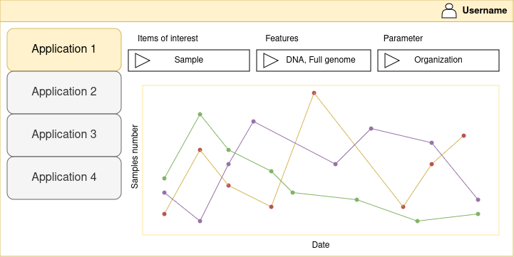

# otuskotlin-202408

Учебный проект студента курса [Kotlin Backend Developer](https://otus.ru/lessons/kotlin/). 
Поток курса 2024-08.

**Геродот (Herodotus)** - микросервис, предназначенный для хранения 
и обобщения информации о работе внешних сервисов. 
Задача сервиса - получать и хранить отчёты о работе подключённых приложений 
и по запросу выдавать пользователю обобщённую статистику по целевым полям за заданный период времени.

Например, некоторое приложение анализирует образцы, загружаемые внешними пользователями, 
принадлежащими к разным организациям. Нашего пользователя интересует статистика по работе его приложения:
сколько образцов (и с какими параметрами) было загружено, кем и когда; 
какая организация проанализировала больше образцов; 
сколько образцов было проанализировано за год, и т.д. и т.п.
Для решения задачи - просим приложение при анализе каждого образца отправлять timestamp 
и отчёт в формате json в Herodotus, и предоставляем API для поиска и аггрегации данных по целевым полям отчётов.

## Визуальная схема фронтенда

## Документация

1. Маркетинг и аналитика
    - [Целевая аудитория](docs/01-marketing/01-target-audience.md)
    - [Стейкхолдеры](docs/01-marketing/02-stakeholders.md)
    - [Пользовательские истории](docs/01-marketing/03-user-stories.md)
2. DevOps
3. Архитектура
    - [Описание API](docs/03-architecture/01-api.md)
    - [Компонентная схема](docs/03-architecture/02-architecture.md)
4. Тесты
